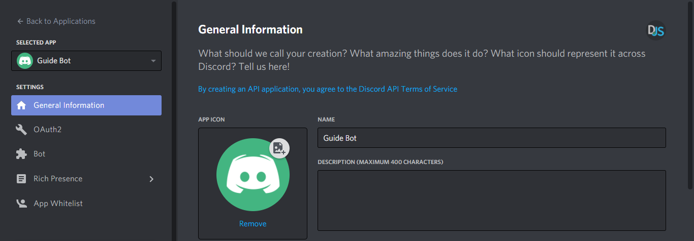
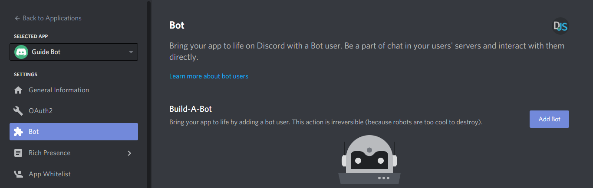
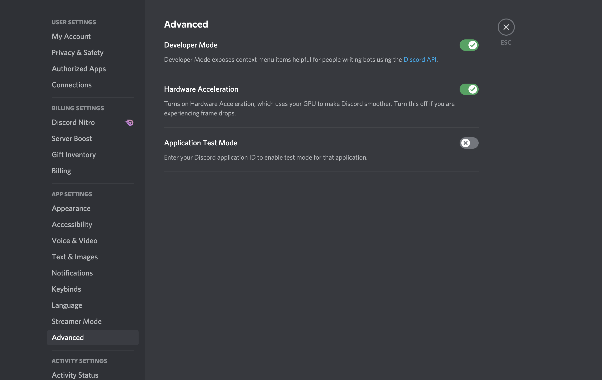

# Install

This discord bot development is platform agnostic. It can be installed locally on windows or unix systems where the discord is available.

These tools can make development quick and are recommended:

-   [git CLI](https://git-scm.com) - version control system
-   [nodejs v16.15.1](https://nodejs.org/en/) - js runtime built on chrome's v8 engine
-   [n](https://github.com/tj/n) - easily change node versions
-   [iterm2](https://iterm2.com/) - enhanced terminal for macOS
-   [discord](https://discord.com/) - popular chat application used for gaming and organized communities

## Configuration Setup

Before the bot is ready to run there are a few configuration items that should be done. First few steps can be done following
the [discord.js guide](https://discordjs.guide/#before-you-begin);

### 1. Create environment file

Please create a `.env` with the keys below

```
DISCORD_BOT_TOKEN=<taken from discord bot applciation page>
DISCORD_BOT_PUBLIC_KEY=<taken from discord application PUBLIC KEY>
DISCORD_BOT_APPLICATION_ID=<taken from discord application APPLICATION ID>
LOGDNA_APP_NAME=<what did you name your bot>
LOGDNA_DEFAULT_LEVEL=debug
LOGDNA_TOKEN=<taken from logdna setup screen>  

# Sentry
SENTRY_IO_DSN=<taken from sentry.io project settings>

```

### 2. Generate bot token

[https://discordjs.guide/preparations/setting-up-a-bot-application.html](https://discordjs.guide/preparations/setting-up-a-bot-application.html)
Create your own discord application and then grab your bot token.  

Retrieve the App's client ID


Retrieve the bot token


### 3. Invite bot to your personal discord

[https://discordjs.guide/preparations/adding-your-bot-to-servers.html#bot-invite-links](https://discordjs.guide/preparations/adding-your-bot-to-servers.html#bot-invite-links)
The newly created bot should be invited to your own discord space/server.

```
https://discord.com/oauth2/authorize?client_id=REPLACE_THIS_HERE&scope=bot+applications.commands
```

### 4. Enable Developer Mode

There should be a small cog near your icon photo labeled "User Settings". Hitting that will allow you to enable developer mode  


### 5. Run application

```
npm install
npm run build
npm run start
```